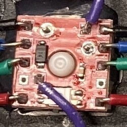

# Single-Switch SMD RGB PCB
A compact PCB designed to add individual, addressable SMD RGB lighting to a single mx mechanical keyboard switch.

---

## Features

* **Compact Footprint:** Minimal size, smaller than 1U
* **Chainable:** Data in/out for LED on either side of board
* **Addressable RGB:** Designed for **SK6812MINI-E** leds 

---

